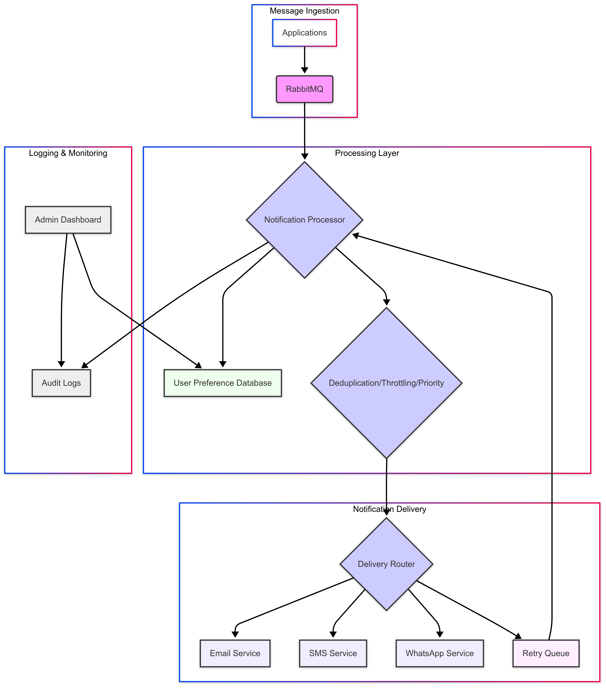

# System Notifications

## System Components
### Message Ingestion
- Applications send notifications as JSON messages via RabbitMQ.
- Messages are validated and stored in the queue for processing.

### Processing Layer
- Notification Processor fetches messages from RabbitMQ.
- Deduplication, throttling, and priority queuing are applied.
- User preferences are retrieved from the User Preference Database.

### Notification Delivery
- Messages are sent via Email, SMS, and WhatsApp delivery services.
- Failed messages go through a Retry Queue.

### Logging & Monitoring
- Audit Logs track sent, failed, and retried messages.
- An Admin Dashboard (future) provides monitoring & analytics.

  

